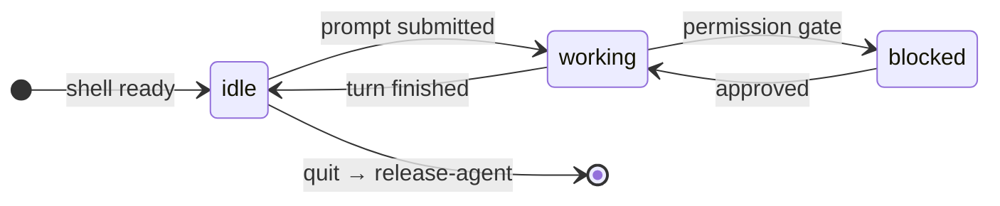

<div align="center">

# 🦎 ZimZilla · Herdr Plugin

**Makes [Herdr](https://herdr.dev) recognise [ZimZilla](https://github.com/Mr-Destroyer/ZimZilla) as a first-class agent.**

<sub>Live `idle` / `working` / `blocked` state · one agent per pane · nothing to configure</sub>

[](https://herdr.dev)
[](https://github.com/Mr-Destroyer/ZimZilla)
[](LICENSE)
[](https://github.com/Mr-Destroyer/ZimZilla-Herdr-Plugin/stargazers)

[**Install**](#-install) · [**Usage**](#️-usage) · [**How it works**](#️-how-it-works) · [**Troubleshooting**](#-troubleshooting)

</div>

---

<div align="center">

```
┌──────────────┐    report-agent     ┌─────────────────┐
│   ZimZilla   │ ──────────────────▶ │      Herdr      │
│   in a pane  │ ◀────────────────── │  sidebar + CLI  │
└──────────────┘    release-agent    └─────────────────┘
```

</div>

Herdr is a terminal workspace manager for coding agents. It tracks which panes hold agents and rolls their `idle` / `working` / `blocked` state up to tabs and workspaces, so you can run several agents at once and see which one needs you.

ZimZilla is not one of the agents Herdr ships support for, so out of the box it shows up as a plain terminal. **This plugin fixes that** — ZimZilla appears in the Herdr sidebar and in `herdr agent list` as `zimzilla`, with live state.

```diff
  AGENT     STATE     PANE
+ zimzilla  working   w1:p2  ← zimzilla
  claude    idle      w1:p3
```

## 🎯 What you get

| 🦎 ZimZilla | 🐑 Herdr shows |
| :--- | :--- |
| shell ready | 🟢 `idle` |
| a turn is running | 🔵 `working` |
| a permission gate is up | 🔴 `blocked` |
| you quit | ⚪ the agent is released |

One agent per pane, so several ZimZilla instances are tracked separately. You also get:

- 🔔 **Herdr notifications** when a turn finishes
- ⏳ **`herdr agent wait`** works against ZimZilla like it does against any other agent

## 📦 Requirements

| | Requirement | Check |
| :--- | :--- | :--- |
| 🐑 | **Herdr** 0.7.0 or later | `herdr --version` |
| 🦎 | **ZimZilla** with the Herdr reporter (`zimzilla/herdr.py`) | see below |

The reporter ships with ZimZilla itself. This plugin does not add it — it **verifies** it is present and shows you what Herdr sees. If your ZimZilla predates the integration, the `install` action tells you so instead of failing silently.

<details>
<summary><b>Check whether you have the reporter</b></summary>

<br>

```bash
python -c "import os, zimzilla; print(os.path.dirname(zimzilla.__file__))"
# then look for herdr.py in that directory
```

</details>

## 🚀 Install

### 1 · 🔗 Link the plugin

```bash
herdr plugin link ~/Documents/ZimZilla-Herdr-Plugin
```

`link` registers the directory in place, so edits you make here take effect without reinstalling.

<details>
<summary><b>Prefer a copy Herdr manages for you?</b></summary>

<br>

Use `install` instead, and Herdr will manage a copy from GitHub:

```bash
herdr plugin install Mr-Destroyer/ZimZilla-Herdr-Plugin
```

</details>

### 2 · ✅ Verify

```bash
herdr plugin action invoke zimzilla.herdr.install
```

You should see something like:

```console
zimzilla:  /home/you/.local/bin/zimzilla
python:    /home/you/ZimZilla/.venv/bin/python
package:   /home/you/ZimZilla/zimzilla
reporter:  /home/you/ZimZilla/zimzilla/herdr.py

Herdr sees:
  no zimzilla agent in this session yet.
  Launch zimzilla in a pane; it registers itself on startup.
```

> [!IMPORTANT]
> If it reports that `herdr.py` is missing, update ZimZilla and try again.

### 3 · 🐣 Launch ZimZilla in a Herdr pane

```bash
zimzilla
```

It registers itself on startup. You will see this line in the transcript:

```console
· herdr: reporting as agent 'zimzilla'
```

And Herdr will list it:

```bash
herdr agent list
```

<div align="center">

**That is the whole setup.** There is nothing to configure and no config file to edit.

</div>

## 🕹️ Usage

### 🔍 Check what Herdr sees

```bash
herdr plugin action invoke zimzilla.herdr.status
```

Lists every agent Herdr currently recognises and marks ZimZilla's row. This is the *"why does my sidebar look like that"* command.

### ⌨️ From the Herdr UI

Both actions are available in the command palette and can be bound to keys. Add to `~/.config/herdr/config.toml`:

```toml
[[keys.command]]
key = "prefix+z"
type = "plugin_action"
command = "zimzilla.herdr.status"
description = "zimzilla herdr status"
```

### 👀 Watch the state change

```bash
# in one pane
zimzilla

# in another
watch -n1 'herdr agent list'
```

Type a prompt in ZimZilla and watch it go `idle` → `working` → `done`.

## ⚙️ How it works

Herdr learns agent state in one of two ways:

| Path | How it works | Who uses it |
| :--- | :--- | :--- |
| **Shipped support** | Herdr finds the agent's process in the pane and reads the live bottom of the screen. Rules in a detection manifest decide whether what it sees means `idle`, `working`, or `blocked`. | Agents Herdr ships support |
| **Self-reporting** | The agent reports its own state. This is the documented path for an agent that supports Herdr from its own code. | 🦎 **ZimZilla** |

> [!NOTE]
> A detection manifest is not an option here. Herdr's own documentation is explicit that remote and local manifests only *patch* rules for agents Herdr already knows how to identify — adding a completely new agent still requires a Herdr binary update.

So ZimZilla calls:

```bash
herdr pane report-agent "$HERDR_PANE_ID" \
  --source zimzilla --agent zimzilla --state working --seq 1791302971102
```

and on exit:

```bash
herdr pane release-agent "$HERDR_PANE_ID" \
  --source zimzilla --agent zimzilla --seq 1791302986106
```



The reporter lives in `zimzilla/herdr.py` inside ZimZilla. It is **inert outside Herdr**: without `HERDR_ENV=1` and the pane variables Herdr injects, it does nothing at all.

Reports go out on a background thread through a single-slot mailbox, so a burst of state changes coalesces to the newest one instead of queueing up behind a slow Herdr. A report can never block a turn or raise into the transcript.

### ♻️ Resume after a server restart

On **Herdr 0.10.0 and later**, ZimZilla also reports a resume command, so a session comes back in the same pane after a Herdr server restart:

```bash
herdr pane report-agent "$HERDR_PANE_ID" \
  --source zimzilla --agent zimzilla --state idle --seq 2 \
  -- zimzilla --workdir /path/to/project --mode auto
```

On older versions the command is dropped and state reporting carries on alone. This is deliberate: Herdr 0.9.x does not understand the `--` that introduces a resume command and rejects the **entire report** with `unknown option: --`, which would cost you the agent state completely. The reporter probes `herdr --version` first and only sends a resume command to a Herdr that can parse one.

```bash
herdr update   # upgrade Herdr to get resume
```

## 🩺 Troubleshooting

<details>
<summary><b>ZimZilla does not appear in <code>herdr agent list</code></b></summary>

<br>

Check you are actually inside a Herdr pane:

```bash
echo "$HERDR_ENV"      # should print 1
echo "$HERDR_PANE_ID"  # should print something like w1:p2
```

If those are empty, ZimZilla is not running under Herdr and will stay silent **by design**.

</details>

<details>
<summary><b>It appeared and then vanished</b></summary>

<br>

Herdr clears an agent once its pane is back at an idle shell prompt. If you reported from a shell script rather than from ZimZilla itself, the agent is cleared as soon as the script exits. ZimZilla holds the pane for as long as it runs, so this does not affect normal use.

</details>

<details>
<summary><b>It shows <code>unknown</code> instead of a state</b></summary>

<br>

`unknown` means Herdr sees an agent but cannot classify it. ZimZilla reports its own state, so this should not happen — check the plugin log:

```bash
herdr plugin log list --plugin zimzilla.herdr
```

</details>

<details>
<summary><b>The <code>install</code> action says <code>herdr.py</code> is missing</b></summary>

<br>

Your ZimZilla predates the Herdr integration. Update it:

```bash
cd ~/ZimZilla && git pull && ./setup.sh
```

</details>

<details>
<summary><b><code>herdr plugin link</code> refuses</b></summary>

<br>

If a plugin with the same id is already registered, unlink it first:

```bash
herdr plugin unlink zimzilla.herdr
herdr plugin link ~/Documents/ZimZilla-Herdr-Plugin
```

</details>

## 🗂️ Files

```
herdr-plugin.toml   manifest — startup hook and two actions
install.sh          verifies the installed ZimZilla can report
status.sh           shows what Herdr currently sees
```

The startup hook runs `install.sh --quiet` once per Herdr server start. It is silent when the integration is healthy, so a broken install shows up in `herdr plugin log list --plugin zimzilla.herdr` rather than going unnoticed.

> [!TIP]
> Both scripts are **read-only**. They install nothing and change nothing.

## 🧹 Uninstall

```bash
herdr plugin unlink zimzilla.herdr
```

ZimZilla keeps reporting to Herdr if it is running in a pane — the plugin only verifies and inspects, it is not what makes the integration work. To turn the reporting off, remove `zimzilla/herdr.py` from your ZimZilla install, or run ZimZilla outside Herdr.

<div align="center">

## 📄 License

MIT — see [LICENSE](LICENSE)

<sub>Built for 🐑 Herdr · Powered by 🦎 ZimZilla</sub>

</div>
